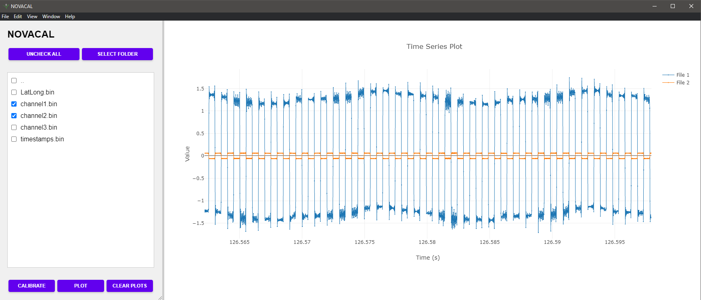

# NOVACAL


##  Overview

NOVACAL is an Electron application with a Go backend, designed to be able to quickly load and plot timeseries data and perform calibrations on data collected with novaminex instruments. 



## ✨ Features

- 📂 File and folder navigation
- 📊 Time series viewer
- 🔧 Calibration tool
- 💾 Import/Export functionality for calibration settings

## Technology Stack

- Frontend: Electron, JavaScript, HTML, CSS
- Backend: Go
- Plotting: Plotly.js

## Getting Started


### Installation

Download NOVACAL Setup 1.0.0.exe from releases tab and run the installer. 

OR 

1. Clone the repository:
   ```
   git clone https://github.com/your-username/nova-toolkit.git
   ```

2. Navigate to the project directory:
   ```
   cd nova-toolkit
   ```

3. Install dependencies:
   ```
   npm install
   ```
   
4. Start the application:
   ```
   npm start
   ```

## 🖥️ Usage

1. **Select Folder**: Choose a directory containing your NOVABOX data folders.
2. **Calibration**: Select folders for calibration, hit "calibrate" button and adjust parameters in the calibration window either manually or by importing a settings.csv file.
3. **Plotting**: Select individual .bin files and click plot for time-series plotting.
4. **Plot Controls**: Double click to reset view, left click + drag to zoom to area, control + scroll to zoom vertically, scroll to zoom horizontally.
5. **Export Results**: Save calibration data as CSV for further analysis.

## 🔧 Configuration

Calibration settings can be imported/exported using CSV files, see included settings.csv file for formatting example. 


## 📄 License

This project is licensed under the MIT License - see the [LICENSE](LICENSE) file for details.
